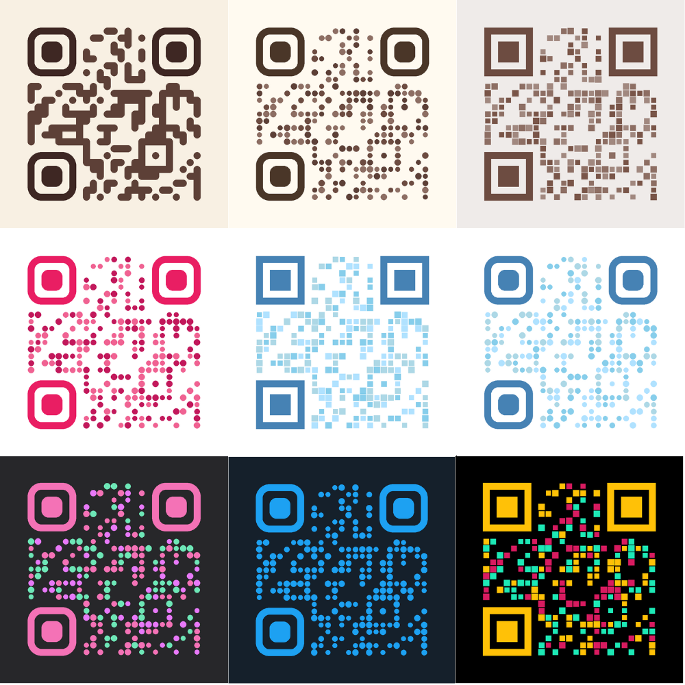

# pretty-qr

Pythonで簡単にデザイン付きQRコードを生成できるライブラリ



## 使い方

### 基本的なQRコードを生成する
```python
from prettyqr.normal_qr import create_qr

data = "https://example.com"

normal_qr_image = create_qr(
    data,
    error_correction="L",
    box_size=20,
    border=4,
)
normal_qr_image.save("normal_qr_code.png")
```


### 角丸のQRコードを生成する
```python
from prettyqr.rounded_qr import create_rounded_qr

data = "https://example.com"

rounded_qr_image = create_rounded_qr(
    data,
    error_correction="L",
    box_size=20,
    border=4,
)
rounded_qr_image.save("rounded_qr_code.png")
```


### ドットのQRコードを生成する
```python
from prettyqr.dot_qr import create_dot_qr

data = "https://example.com"

# ドット(丸) のQRコードを生成
dot_qr_image = create_dot_qr(
    data,
    error_correction="L",
    box_size=20,
    border=4,
)
dot_qr_image.save("dot_qr_code.png")

# ドット(四角) のQRコードを生成
square_qr_image = create_dot_qr(
    data,
    error_correction="L",
    box_size=20,
    border=4,
    dot_radius=0,
)
square_qr_image.save("square_qr_image_qr_code.png")
```


### QRコードの色を指定する

```python
from prettyqr.normal_qr import create_qr

data = "https://example.com"

normal_qr_image = create_qr(
    data,
    error_correction="L",
    box_size=20,
    border=4,
    fill_color="black", # QRコードの色
    back_color="white", # 背景色
    finder_color="black", # ファインダーパターンの色
)

normal_qr_image.save("normal_qr_code_color.png")
```

同じように、すべての関数で色を指定することができます。

また、`create_dot_qr` では、リストで複数の色を指定することができます。
この場合、QRコードのドットの色がランダムに選ばれます。
```python
from prettyqr.dot_qr import create_dot_qr

data = "https://example.com"

dot_qr_image = create_dot_qr(
    data,
    error_correction="L",
    box_size=20,
    border=4,
    fill_color=["red", "blue", "green"], # QRコードの色
    back_color="white", # 背景色
    finder_color="black", # ファインダーパターンの色
)
dot_qr_image.save("dot_qr_code_color.png")
```

### QRコードの形状を指定する

#### `create_rounded_qr`
引数:
- finder_radius: ファインダーパターンの角丸の半径 (0.0~1.0)

#### `create_dot_qr`
引数:
- finder_radius: ファインダーパターンの角丸の半径 (0.0~1.0)
- dot_radius: ドットの半径 (0.0~1.0)
- dot_size: ドットのサイズ (0.0~1.0)

dot_sizeは、リストで複数のサイズを指定することができます。
この場合、QRコードのドットのサイズがランダムに選ばれます。

## ライセンス
MIT License

